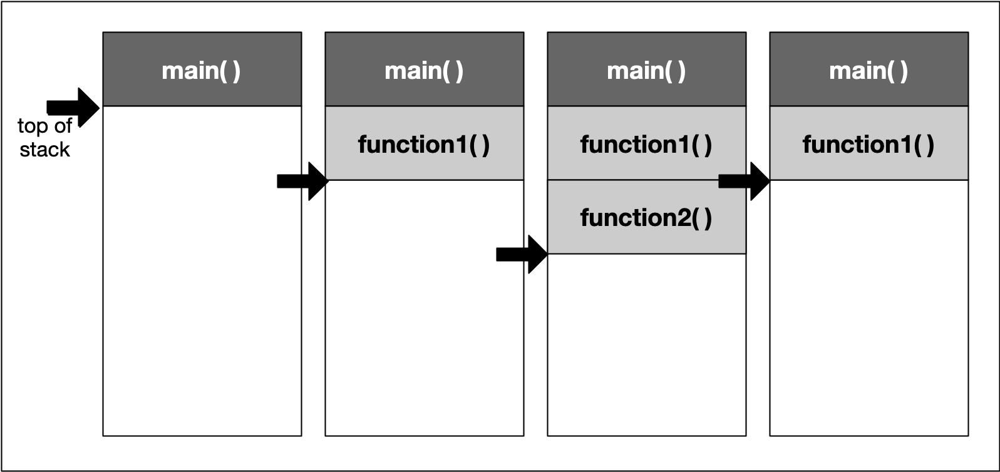

## Stack Growth and Contraction

In the first experiment, we will look at the behavior of the stack when local variables are allocated and a function is called. Consider the piece of code on the right.

Within the main function, we see two declarations of local variables `i` and `j` followed by a call to `MyFunc`, where another local variable is allocated. After `MyFunc` returns, another local variable is allocated in `main`.  The program generates the following output: 

```
1: 0x7ffeefbff688 
2: 0x7ffeefbff684 
3: 0x7ffeefbff65c 
4: 0x7ffeefbff680 
```

Between 1 and 2, the stack address is reduced by 4 bytes, which corresponds to the allocation of memory for the int `j`. 

Between 2 and 3, the address pointer is moved by 0x28. We can easily see that calling a function causes a significant amount of memory to be allocated.  In addition to the local variable of `MyFunc`, the compiler needs to store additional data such as the return address. 

Between 3 and 4, `MyFunc` has returned and a third local variable `k` has been allocated on the stack. The stack pointer now has moved back to a location which is 4 bytes relative to position 2. This means that after returning from `MyFunc`, the stack has contracted to the size it had before the function call. 

The following diagram illustrates how the stack grows and contracts during program execution:




<!--
%%ulab_page_divider
--><hr/>

## Total Stack Size
When a thread is created, stack memory  is allocated by the operating system as a contiguous block. With each new function call or local variable allocation, the stack pointer is moved until eventually it will reach the bottom of said memory block. Once it exceeds this limit (which is called "stack overflow"), the program will crash. We will try to find out the limit of your computer’s stack memory in the following exercise.

<!--
%%ulab_page_divider
--><hr/>

### Exercise: Create a Stack Overflow
Your task is to create a small program that allocates so much stack memory that an overflow happens. To do this, use a function that allocates some local variable and calls itself recursively. With each new function call, the address of the local variable shall be printed to the console along with the address of a local variable in main which has been allocated before the first function call. 

The output of the program should look like this: 
```
...
262011: stack bottom : 0x7ffeefbff688, current : 0x7ffeef400704
262012: stack bottom : 0x7ffeefbff688, current : 0x7ffeef4006e4
262013: stack bottom : 0x7ffeefbff688, current : 0x7ffeef4006c4
262014: stack bottom : 0x7ffeefbff688, current : 0x7ffeef4006a4
262015: stack bottom : 0x7ffeefbff688, current : 0x7ffeef400684
262016: stack bottom : 0x7ffeefbff688, current : 0x7ffeef400664
```

The left-most number keeps track of the recursion depth while the difference between the stack bottom and the current position of the stack pointer lets us compute the size of the stack memory which has been used up already. On my MacBook Pro, the size of the stack memory is at 8MB. On Mac or Linux systems, stack size can be checked using the command `ulimit -s`:
```
imac-pro:~ ahaja$ ulimit -s
8192
```

On reaching the last line in the above output, the program crashed. As expected, the difference between stack bottom and current stack pointer corresponded to the maximum size of the stack: 
`0x7ffeef400664 - 0x7ffeefbff688 = 0xffffffffff800FDC = 8.384.548 bytes`

From this experiment we can draw the simple conclusion that we do not want to run out of stack memory. This can happen quickly though, even on machines with large amounts of RAM installed. As we have seen, the size of the stack does not benefit from this at all but remains fixed at a very small size. 

```
#include <stdio.h>
    
int id = 0; 

void MyRecursiveFunc(int &i)
{
    int j = 1;
    printf ("%d: stack bottom : %p, current : %p\n",id++, &i, &j);
    MyRecursiveFunc(i);
}

int main()
{
    int i = 0; 
    MyRecursiveFunc(i);

    return 0; 
}
```
